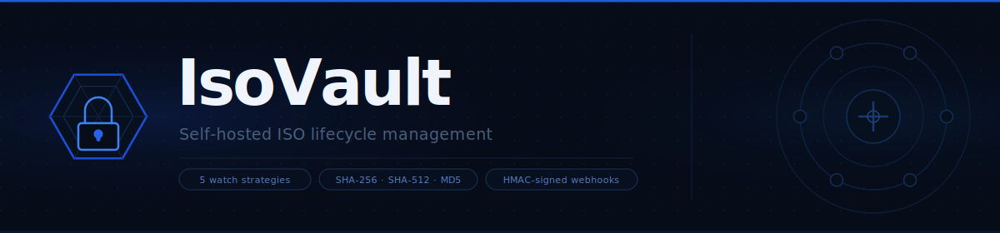
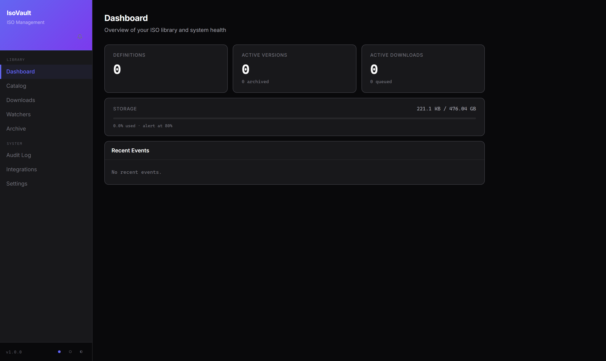
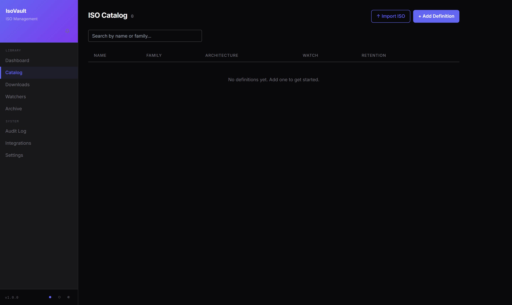
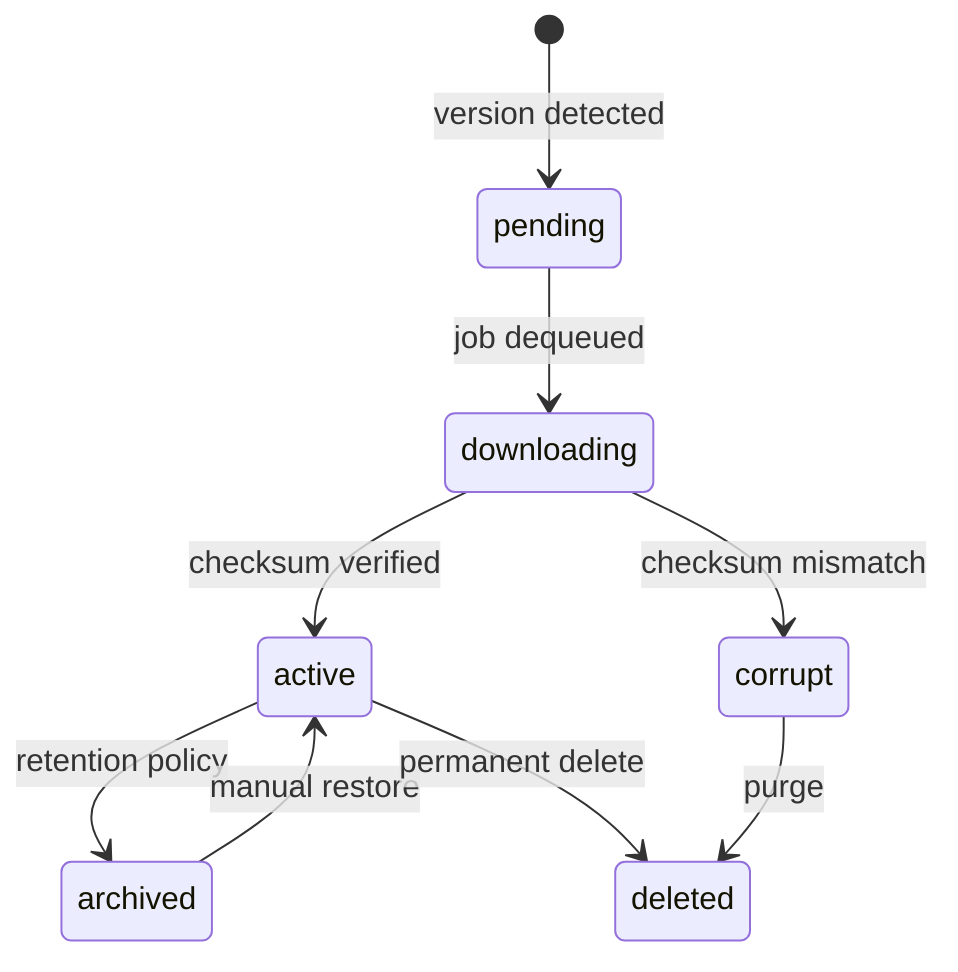
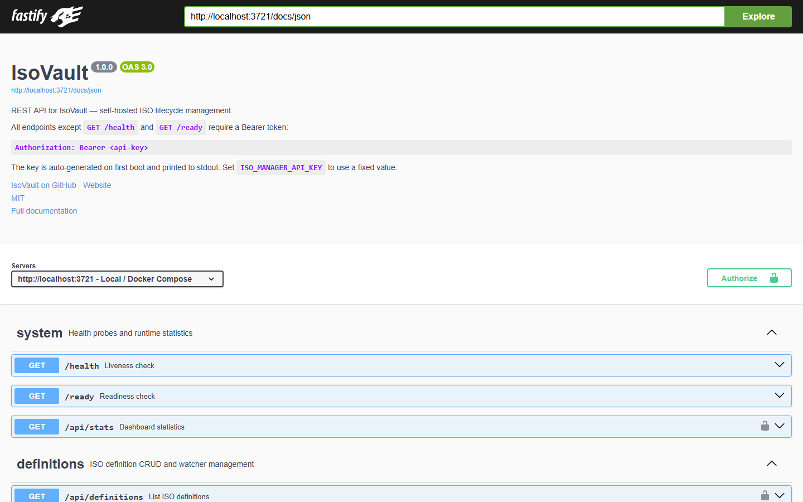

<div align="center">
  
</div>

<div align="center">

[](https://github.com/24Skater/isovault/actions)
[](./LICENSE)
[](https://nodejs.org)
[](https://github.com/24Skater/isovault/releases)

</div>

---

IsoVault is a self-hosted service for managing OS ISO files. Define a source, choose a watch strategy, and IsoVault handles version discovery, download queuing, checksum verification, retention rotation, and signed webhook delivery — without manual intervention.

<div align="center">
  
  <br/><br/>
  
</div>

## Contents

- [Quick Start](#quick-start)
- [How It Works](#how-it-works)
- [Configuration](#configuration)
- [Authentication](#authentication)
- [API Reference](#api-reference)
- [Webhooks](#webhooks)
- [Backups](#backups)
- [Development](#development)

---

## Quick Start

**Requirements:** Docker and Docker Compose, or Node.js ≥ 20

```bash
git clone https://github.com/24Skater/isovault.git
cd isovault
cp .env.example .env
docker compose up -d
```

Retrieve your auto-generated API key from the first-boot log:

```bash
docker compose logs backend | grep "API key"
```

Open the dashboard at **[http://localhost:3721](http://localhost:3721)**.

<details>
<summary>Local development (no Docker)</summary>

```bash
npm install
cp .env.example .env
# Set ISO_STORE_PATH to a writable directory in .env
npm run dev
```

The backend starts on `:3721` and the Vite dev server on `:5173`.

</details>

<details>
<summary>docker-compose.yml reference</summary>

```yaml
services:
  isovault:
    image: isovault:latest
    restart: unless-stopped
    ports:
      - "3721:3721"
    volumes:
      - /path/to/iso-store:/data/iso-store   # ISO file storage
      - isovault-db:/data/db                  # SQLite database + backups
      - ./config.yaml:/app/config.yaml:ro
    environment:
      NODE_ENV: production
      ISO_MANAGER_API_KEY: ${ISO_MANAGER_API_KEY:-}
      ISO_STORE_PATH: /data/iso-store

volumes:
  isovault-db:
```

Health probes (`/health`, `/ready`) are available for container orchestration.

</details>

---

## How It Works

Each OS distribution is modeled as an **ISO Definition** — a record that describes where a distro lives, how to detect new versions, and what to do with old ones. Definitions run independently on configurable schedules.

### Watch strategies

| Strategy | Detection method | Typical use |
|---|---|---|
| `rss` | Polls an RSS/Atom feed; extracts version from item titles | Fedora, Arch Linux |
| `html_scrape` | Fetches a page; CSS selectors pick the version string and download link | Ubuntu releases page |
| `json_api` | Polls a JSON endpoint; dot-path expressions navigate to version and URL | GitHub Releases API |
| `checksum` | Downloads a checksum file; a changed hash signals a new release | Debian, Alpine stable |
| `filename` | Scans a directory index with a regex; constructs the download URL from a template | kernel.org mirrors |

### Version lifecycle



### Defining a source

```bash
curl -sX POST http://localhost:3721/api/definitions \
  -H "Authorization: Bearer $API_KEY" \
  -H "Content-Type: application/json" \
  -d '{
    "name":                 "Ubuntu 24.04 LTS",
    "family":               "ubuntu",
    "architecture":         "x86_64",
    "checksumAlgo":         "sha256",
    "retentionCount":       3,
    "retentionBehavior":    "archive",
    "watchEnabled":         true,
    "watchStrategy":        "html_scrape",
    "watchIntervalMinutes": 1440,
    "watchConfig": {
      "pageUrl":              "https://releases.ubuntu.com/noble/",
      "versionSelector":      "h1",
      "downloadLinkSelector": "a[href$=\".iso\"]"
    }
  }'
```

When a new version is detected, IsoVault queues the download, verifies the checksum, rotates old versions according to the retention policy, and fires any registered webhooks.

---

## Configuration

IsoVault reads `config.yaml` at startup (path overridable via `ISO_MANAGER_CONFIG`). Every value can be overridden with an environment variable.

### Server and storage

| `config.yaml` key | Env var | Default | Description |
|---|---|---|---|
| `server.port` | `PORT` | `3721` | HTTP listen port |
| `server.host` | — | `0.0.0.0` | Bind address |
| `storage.path` | `ISO_STORE_PATH` | `/data/iso-store` | Root directory for ISO files |
| `storage.alert_threshold_percent` | — | `80` | Dashboard disk-usage warning threshold |

### Downloads and retention

| `config.yaml` key | Default | Description |
|---|---|---|
| `downloads.max_concurrent` | `3` | Parallel download slots |
| `downloads.retry_max_attempts` | `3` | Per-file retry limit |
| `downloads.retry_base_delay_seconds` | `30` | Exponential backoff base |
| `downloads.timeout_seconds` | `3600` | Per-download hard timeout |
| `retention.default_count` | `5` | Versions to keep per definition |
| `retention.default_behavior` | `archive` | `archive` or `delete` excess versions |

### Scheduler

| `config.yaml` key | Default | Description |
|---|---|---|
| `scheduler.watcher_check_interval_cron` | `0 * * * *` | How often watchers run |
| `scheduler.db_backup_cron` | `0 2 * * *` | Database backup schedule |
| `scheduler.cleanup_cron` | `0 3 * * *` | Retention enforcement schedule |

### Security and logging

| `config.yaml` key | Default | Description |
|---|---|---|
| `security.ssrf_protection` | `true` | Block private-range download URLs |
| `security.max_redirects` | `5` | Maximum HTTP redirects per request |
| `logging.level` | `info` | `debug` \| `info` \| `warn` \| `error` |
| `logging.retention_days` | `30` | Audit log retention window |

### Environment-only variables

| Variable | Description |
|---|---|
| `ISO_MANAGER_API_KEY` | Fixed API key — auto-generated on first boot if unset |
| `ISO_MANAGER_CONFIG` | Path to `config.yaml` |
| `ISO_MANAGER_DB_PATH` | SQLite database path override |
| `ISO_MANAGER_LOG_LEVEL` | Log level override |
| `NODE_ENV` | Set to `production` to disable stack traces and pretty-printing |

---

## Authentication

Every request except `GET /health` and `GET /ready` requires a Bearer token:

```http
Authorization: Bearer <api-key>
```

The key is auto-generated on first boot and printed once to stdout. To use a fixed key, set it before starting:

```env
ISO_MANAGER_API_KEY=your-secret-key
```

**Key rotation:** delete the `api_key_hash` row from the `settings` table and restart. The new key prints to the log on next boot.

---

## API Reference

All endpoints return JSON. Errors follow [RFC 7807](https://www.rfc-editor.org/rfc/rfc7807) and include a `requestId` field for log correlation.

Interactive documentation is available at **[http://localhost:3721/docs](http://localhost:3721/docs)** once the server is running. Paste your API key into the **Authorize** dialog to try endpoints directly from the browser.

<div align="center">
  
</div>

<details>
<summary>Endpoints</summary>

| Method | Path | Auth | Description |
|---|---|:---:|---|
| `GET` | `/health` | — | Liveness check — 200 if the process is running |
| `GET` | `/ready` | — | Readiness check — 503 if DB or storage is unavailable |
| `GET` | `/docs` | — | Interactive Swagger UI |
| `GET` | `/api/stats` | ✓ | Aggregated dashboard statistics |
| `GET` | `/api/definitions` | ✓ | List all ISO definitions |
| `POST` | `/api/definitions` | ✓ | Create a definition |
| `GET` | `/api/definitions/:id` | ✓ | Get a single definition |
| `PUT` | `/api/definitions/:id` | ✓ | Update a definition |
| `DELETE` | `/api/definitions/:id` | ✓ | Delete a definition |
| `POST` | `/api/definitions/:id/watch/trigger` | ✓ | Trigger a watcher check immediately |
| `GET` | `/api/definitions/:id/versions` | ✓ | List versions for a definition |
| `POST` | `/api/definitions/:id/versions/import` | ✓ | Import an ISO you already have (upload or server path) |
| `GET` | `/api/versions` | ✓ | Cross-definition version query (`?status=archived`) |
| `GET` | `/api/versions/:id/download` | ✓ | Stream the ISO file |
| `GET` | `/api/versions/:id/verify` | ✓ | Re-verify checksum on disk |
| `PATCH` | `/api/versions/:id/archive` | ✓ | Archive a version |
| `PATCH` | `/api/versions/:id/activate` | ✓ | Restore an archived version |
| `DELETE` | `/api/versions/:id` | ✓ | Permanently delete version and file |
| `GET` | `/api/downloads` | ✓ | List active and queued jobs |
| `POST` | `/api/downloads` | ✓ | Trigger a manual download |
| `GET` | `/api/downloads/:id` | ✓ | Get a download job |
| `DELETE` | `/api/downloads/:id` | ✓ | Cancel a download |
| `GET` | `/api/watchers` | ✓ | List watch-enabled definitions |
| `GET` | `/api/audit` | ✓ | Audit log (`?severity=warn&eventType=download.failed`) |
| `GET` | `/api/settings` | ✓ | List all runtime settings |
| `PUT` | `/api/settings/:key` | ✓ | Update a runtime setting |
| `GET` | `/api/storage/stats` | ✓ | Disk usage for the ISO store |
| `GET` | `/api/webhooks` | ✓ | List webhooks |
| `POST` | `/api/webhooks` | ✓ | Register a webhook |
| `GET` | `/api/webhooks/:id` | ✓ | Get a webhook |
| `PATCH` | `/api/webhooks/:id` | ✓ | Update a webhook |
| `DELETE` | `/api/webhooks/:id` | ✓ | Delete a webhook |
| `POST` | `/api/webhooks/:id/test` | ✓ | Send a test event |

</details>

<details>
<summary>Pagination</summary>

List endpoints accept `?page=1&limit=50` and respond with:

```json
{
  "data": [],
  "total": 142,
  "page": 1,
  "limit": 50
}
```

</details>

<details>
<summary>Error shape (RFC 7807)</summary>

```json
{
  "type": "https://httpstatuses.com/404",
  "title": "Not Found",
  "status": 404,
  "detail": "ISO definition abc-123 does not exist",
  "requestId": "req-7f3a1b2c"
}
```

</details>

---

## Webhooks

IsoVault delivers signed `POST` requests when key events occur. Payloads include an `X-IsoVault-Signature` header when a secret is configured on the webhook.

### Signature header

```
X-IsoVault-Signature: sha256=<hex-digest>
```

Verify the signature before processing the payload:

```python
import hashlib, hmac

def verify(secret: str, body: bytes, header: str) -> bool:
    expected = "sha256=" + hmac.new(secret.encode(), body, hashlib.sha256).hexdigest()
    return hmac.compare_digest(expected, header)
```

```typescript
import { createHmac, timingSafeEqual } from "crypto";

function verify(secret: string, body: Buffer, header: string): boolean {
  const expected = "sha256=" + createHmac("sha256", secret).update(body).digest("hex");
  return timingSafeEqual(Buffer.from(expected), Buffer.from(header));
}
```

### Events

| Event | Fired when |
|---|---|
| `download.progress` | Download in progress — includes bytes transferred, speed, and ETA |
| `download.completed` | ISO fully written and checksum verified |
| `download.failed` | All retry attempts exhausted |
| `download.cancelled` | Job cancelled via the API |
| `version.detected` | Watcher finds a version string not previously seen |
| `integrity.failed` | Checksum mismatch on a downloaded file |
| `retention.applied` | Retention policy archived or deleted one or more versions |

### Registering a webhook

```bash
curl -sX POST http://localhost:3721/api/webhooks \
  -H "Authorization: Bearer $API_KEY" \
  -H "Content-Type: application/json" \
  -d '{
    "url":    "https://your-server.example.com/hooks/isovault",
    "secret": "your-webhook-secret",
    "events": ["download.completed", "integrity.failed", "version.detected"]
  }'
```

---

## Backups

SQLite is backed up daily at **2 AM** (configurable via `scheduler.db_backup_cron`). Backup files are written alongside the database:

```
iso-manager-YYYYMMDD-HHmmss.sqlite3
```

The last **7 backups** are kept automatically. No external tooling required.

---

## Development

```bash
npm run dev        # Backend on :3721 + Vite dev server on :5173, with live reload
npm run build      # Compile both packages for production
npm test           # Backend unit tests (Jest)
npm run typecheck  # TypeScript across all packages
npm run lint       # ESLint across all packages
```

| Package | Path | Stack |
|---|---|---|
| `@isovault/backend` | `packages/backend/` | Fastify · better-sqlite3 · node-cron · TypeScript |
| `@isovault/frontend` | `packages/frontend/` | React 18 · Vite · Tailwind CSS · TypeScript |
| `@isovault/e2e` | `packages/e2e/` | End-to-end test suite |

---

## Contributing

Pull requests are welcome. For significant changes, open an issue first.

```bash
git clone https://github.com/24Skater/isovault.git
cd isovault && npm install
npm run dev
npm test
```

---

## License

[MIT](./LICENSE) © 2024 Emerson Ramos
