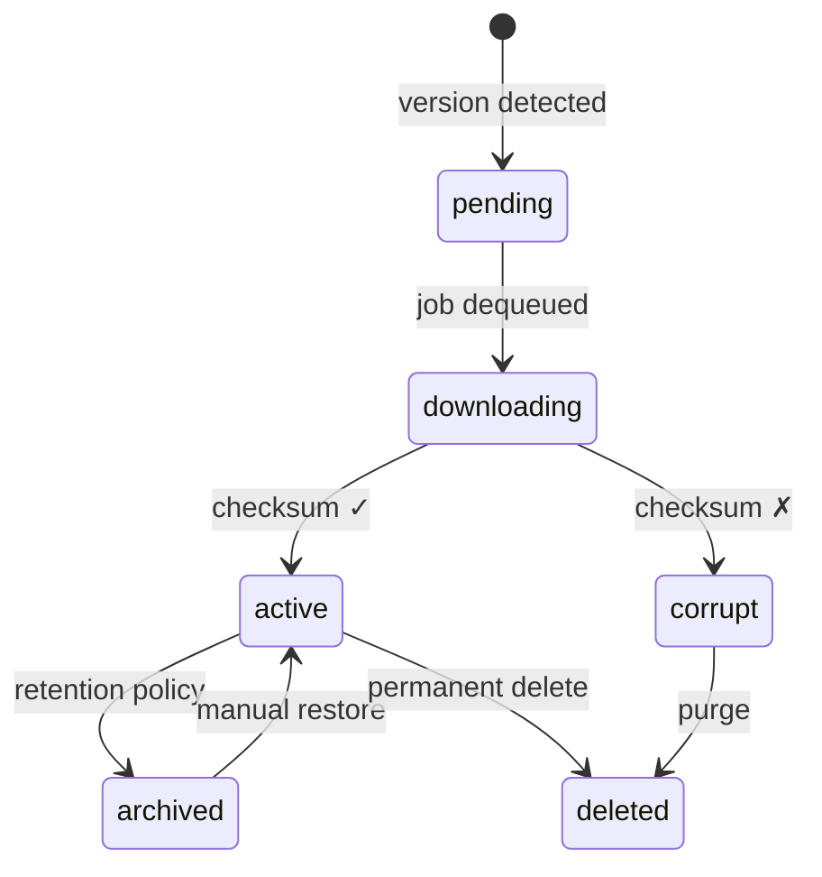

<div align="center">

<h1>🗄️ IsoVault</h1>

<p><strong>Self-hosted ISO library that watches, downloads, verifies, and rotates OS distributions automatically.</strong></p>

<p>
  <a href="#quick-start">Quick Start</a> •
  <a href="#how-it-works">How It Works</a> •
  <a href="#configuration">Configuration</a> •
  <a href="#api-reference">API</a> •
  <a href="#webhooks">Webhooks</a>
</p>


</div>

---

IsoVault gives homelabbers and sysadmins a single place to manage OS ISO files. Point it at an RSS feed, a webpage, a JSON API, or a checksum file — it handles discovery, download queuing, integrity verification, retention rotation, and signed webhook delivery, all without manual intervention.

```
┌───────────────┐   watch   ┌──────────────────┐   queue   ┌──────────────┐
│  RSS / HTML   │──────────▶│  Watcher Engine   │──────────▶│   Downloader │
│  JSON / CRON  │           │  (5 strategies)   │           │  (3 parallel)│
└───────────────┘           └──────────────────┘           └──────┬───────┘
                                                                   │
                    ┌──────────────────────────────────────────────┤
                    ▼                    ▼                          ▼
             ┌─────────────┐   ┌──────────────────┐   ┌───────────────────┐
             │  Checksum   │   │  Retention Policy │   │  Webhook Delivery │
             │  Verifier   │   │  (archive/delete) │   │  (HMAC-SHA256)    │
             └─────────────┘   └──────────────────┘   └───────────────────┘
```

---

## Features

**Discovery**
- 📡 **5 watch strategies** — RSS feeds, HTML scraping, JSON APIs, checksum diffing, and filename patterns
- 🕐 **Cron-scheduled polling** — per-definition intervals, configurable globally

**Downloads**
- ⚡ **Concurrent queue** — up to 3 parallel downloads with per-download retry and backoff
- 📶 **Real-time progress** — WebSocket stream with bytes/sec and ETA
- 🔁 **Automatic retry** — configurable attempts and base delay

**Integrity**
- 🔒 **Checksum verification** — SHA-256, SHA-512, and MD5; re-verify any file on demand
- 🛡️ **SSRF protection** — blocks private-range and loopback download targets
- 🔗 **Redirect limits** — max 5 hops by default

**Storage & Retention**
- 🗂️ **Per-definition policies** — keep the last N versions; archive or permanently delete the rest
- 💾 **Daily SQLite backups** — auto-rotated, last 7 kept
- 📊 **Disk usage monitoring** — configurable alert threshold on the dashboard

**Observability**
- 📋 **Audit log** — every operation recorded with severity levels and entity context
- 🪝 **Signed webhooks** — HMAC-SHA256 on every event delivery
- 🩺 **Liveness + readiness probes** — `/health` and `/ready` for container orchestration

---

## Quick Start

**Requirements:** Docker and Docker Compose (or Node.js ≥ 20 for local dev)

```bash
git clone https://github.com/owner/isovault.git
cd isovault
cp .env.example .env
docker compose up -d
```

Get your auto-generated API key from the first-boot log:

```bash
docker compose logs backend | grep "API key"
```

Open the dashboard at **[http://localhost:3721](http://localhost:3721)**.

<details>
<summary>Local development (no Docker)</summary>

```bash
npm install
cp .env.example .env
# Set ISO_STORE_PATH to a writable local directory in .env
npm run dev
```

Backend runs on `:3721`, frontend dev server on `:5173`.

</details>

<details>
<summary>docker-compose.yml reference</summary>

```yaml
services:
  isovault:
    image: isovault:latest
    restart: unless-stopped
    ports:
      - "3721:3721"
    volumes:
      - /path/to/iso-store:/data/iso-store   # where ISOs are saved
      - isovault-db:/data/db                 # SQLite + backups
      - ./config.yaml:/app/config.yaml:ro
    environment:
      NODE_ENV: production
      ISO_MANAGER_API_KEY: ${ISO_MANAGER_API_KEY:-}
      ISO_STORE_PATH: /data/iso-store

volumes:
  isovault-db:
```

</details>

---

## How It Works

IsoVault models every OS distribution as an **ISO Definition** — a record that describes where a distro lives, how to detect new versions, and what to do with old ones. Each definition runs independently on its own schedule.

### Watch Strategies

| Strategy | How detection works | Example use |
|----------|---------------------|-------------|
| `rss` | Polls an RSS/Atom feed, extracts version from item titles | Fedora, Arch Linux announcements |
| `html_scrape` | Fetches a webpage and uses CSS selectors to find version + download link | Ubuntu releases page |
| `json_api` | Polls a JSON endpoint, extracts version and URL via dot-path expressions | GitHub Releases API |
| `checksum` | Downloads a checksum file and compares hash to detect a changed release | Debian, Alpine stable |
| `filename` | Scans a directory index using a regex, constructs the download URL from a template | kernel.org mirrors |

### Download lifecycle



### Example: define Ubuntu with HTML scraping

```bash
curl -X POST http://localhost:3721/api/definitions \
  -H "Authorization: Bearer $API_KEY" \
  -H "Content-Type: application/json" \
  -d '{
    "name": "Ubuntu 24.04 LTS",
    "family": "ubuntu",
    "architecture": "x86_64",
    "checksumAlgo": "sha256",
    "retentionCount": 3,
    "retentionBehavior": "archive",
    "watchEnabled": true,
    "watchStrategy": "html_scrape",
    "watchIntervalMinutes": 1440,
    "watchConfig": {
      "pageUrl": "https://releases.ubuntu.com/noble/",
      "versionSelector": "h1",
      "downloadLinkSelector": "a[href$='.iso']"
    }
  }'
```

When a new version is detected, IsoVault queues the download, verifies the checksum, archives older versions, and fires your webhooks — automatically.

---

## Configuration

IsoVault reads `config.yaml` at startup. All values can be overridden with environment variables.

| `config.yaml` key | Env var | Default | Description |
|---|---|---|---|
| `server.port` | `PORT` | `3721` | HTTP listen port |
| `server.host` | — | `0.0.0.0` | Bind address |
| `storage.path` | `ISO_STORE_PATH` | `/data/iso-store` | Root directory for ISO files |
| `storage.alert_threshold_percent` | — | `80` | Dashboard disk warning level (%) |
| `downloads.max_concurrent` | — | `3` | Parallel download slots |
| `downloads.retry_max_attempts` | — | `3` | Per-file retry limit |
| `downloads.retry_base_delay_seconds` | — | `30` | Backoff base delay |
| `downloads.timeout_seconds` | — | `3600` | Per-download timeout |
| `retention.default_count` | — | `5` | Versions to keep per definition |
| `retention.default_behavior` | — | `archive` | `archive` or `delete` excess versions |
| `scheduler.watcher_check_interval_cron` | — | `0 * * * *` | Watcher sweep frequency |
| `scheduler.db_backup_cron` | — | `0 2 * * *` | Database backup time |
| `scheduler.cleanup_cron` | — | `0 3 * * *` | Retention enforcement time |
| `security.ssrf_protection` | — | `true` | Block private-range download URLs |
| `security.max_redirects` | — | `5` | Max HTTP redirects per download |
| `logging.level` | `ISO_MANAGER_LOG_LEVEL` | `info` | `debug` \| `info` \| `warn` \| `error` |
| `logging.retention_days` | — | `30` | Audit log retention |

### Environment-only variables

| Variable | Description |
|---|---|
| `ISO_MANAGER_API_KEY` | Fixed API key (auto-generated on first boot if unset) |
| `ISO_MANAGER_CONFIG` | Path to `config.yaml` (default: `./config.yaml`) |
| `ISO_MANAGER_DB_PATH` | SQLite database path override |
| `NODE_ENV` | Set to `production` to disable stack traces and pretty logs |

---

## Authentication

Every request except `GET /health` and `GET /ready` requires a Bearer token:

```http
Authorization: Bearer <api-key>
```

The key is auto-generated on first boot and printed once to stdout. To use a fixed key, set it before starting:

```env
ISO_MANAGER_API_KEY=your-secret-key
```

To rotate the key, delete the `api_key_hash` row from the `settings` table and restart. The new key is printed to the log on the next boot.

---

## API Reference

All endpoints return JSON. Errors follow [RFC 7807](https://www.rfc-editor.org/rfc/rfc7807) with a `requestId` field for log correlation.

<details>
<summary>Full endpoint table</summary>

| Method | Path | Description |
|--------|------|-------------|
| `GET` | `/health` | Liveness check — always 200 if the process is up (no auth) |
| `GET` | `/ready` | Readiness check — 503 if DB or storage is unavailable (no auth) |
| `GET` | `/api/stats` | Aggregated dashboard stats |
| `GET` | `/api/definitions` | List all ISO definitions |
| `POST` | `/api/definitions` | Create a new definition |
| `GET` | `/api/definitions/:id` | Get a single definition |
| `PATCH` | `/api/definitions/:id` | Update a definition |
| `DELETE` | `/api/definitions/:id` | Delete a definition |
| `GET` | `/api/definitions/:id/versions` | List versions for a definition |
| `GET` | `/api/versions` | Cross-definition version query (`?status=archived`) |
| `GET` | `/api/versions/:id/download` | Stream the ISO file |
| `GET` | `/api/versions/:id/verify` | Re-verify checksum on disk |
| `PATCH` | `/api/versions/:id/archive` | Archive a version |
| `PATCH` | `/api/versions/:id/activate` | Restore an archived version |
| `DELETE` | `/api/versions/:id` | Permanently delete version + file |
| `GET` | `/api/downloads` | List active and queued download jobs |
| `POST` | `/api/downloads` | Trigger a manual download |
| `DELETE` | `/api/downloads/:id` | Cancel a queued or running download |
| `GET` | `/api/audit` | Audit log (`?severity=warn&eventType=download.failed`) |
| `GET` | `/api/settings` | List all runtime settings |
| `PUT` | `/api/settings/:key` | Update a runtime setting |
| `GET` | `/api/storage/stats` | Disk usage for the ISO store |
| `GET` | `/api/webhooks` | List registered webhooks |
| `POST` | `/api/webhooks` | Register a new webhook |
| `PATCH` | `/api/webhooks/:id` | Update a webhook |
| `DELETE` | `/api/webhooks/:id` | Delete a webhook |
| `POST` | `/api/webhooks/:id/test` | Send a test event to a webhook |

</details>

<details>
<summary>Paginated responses</summary>

Endpoints that return lists support `?page=1&limit=50` and respond with:

```json
{
  "data": [...],
  "total": 142,
  "page": 1,
  "limit": 50
}
```

</details>

<details>
<summary>Error response shape (RFC 7807)</summary>

```json
{
  "type": "https://httpstatuses.com/404",
  "title": "Not Found",
  "status": 404,
  "detail": "ISO definition abc123 does not exist",
  "requestId": "req-7f3a1b2c"
}
```

</details>

---

## Webhooks

IsoVault fires webhook `POST` requests when key events occur. Each payload is delivered with an `X-IsoVault-Signature` header when a secret is configured.

### Signed header

```http
X-IsoVault-Signature: sha256=<hex-digest>
```

Verify in your receiver before processing:

```python
import hashlib, hmac

def verify_signature(secret: str, body: bytes, header: str) -> bool:
    expected = "sha256=" + hmac.new(
        secret.encode(), body, hashlib.sha256
    ).hexdigest()
    return hmac.compare_digest(expected, header)
```

```typescript
import { createHmac, timingSafeEqual } from "crypto";

function verifySignature(secret: string, body: Buffer, header: string): boolean {
  const expected = "sha256=" + createHmac("sha256", secret).update(body).digest("hex");
  return timingSafeEqual(Buffer.from(expected), Buffer.from(header));
}
```

### Webhook events

| Event | Fired when |
|-------|-----------|
| `download.progress` | Ongoing — includes bytes, speed, and ETA |
| `download.completed` | ISO fully written and verified |
| `download.failed` | All retries exhausted |
| `download.cancelled` | Job cancelled via API |
| `version.detected` | Watcher finds a previously-unseen version string |
| `integrity.failed` | Checksum mismatch on a downloaded file |
| `retention.applied` | Retention policy archived or deleted versions |

Register a webhook with specific event filters:

```bash
curl -X POST http://localhost:3721/api/webhooks \
  -H "Authorization: Bearer $API_KEY" \
  -H "Content-Type: application/json" \
  -d '{
    "url": "https://your-server.example.com/hooks/isovault",
    "secret": "your-webhook-secret",
    "events": ["download.completed", "integrity.failed", "version.detected"]
  }'
```

---

## Backups

SQLite is backed up daily at **2 AM** via the configured cron (`scheduler.db_backup_cron`). Backups are written alongside the database as:

```
iso-manager-YYYYMMDD-HHmmss.sqlite3
```

The last **7 backups** are kept; older ones are purged automatically. No external tooling required.

---

## Development

```bash
npm run dev        # backend :3721 + frontend :5173 with live reload
npm run build      # compile both packages for production
npm test           # backend unit tests (Jest)
npm run typecheck  # TypeScript check across all packages
npm run lint       # ESLint across all packages
```

| Package | Path | Description |
|---------|------|-------------|
| `@isovault/backend` | `packages/backend/` | Fastify API, watcher engine, scheduler, SQLite |
| `@isovault/frontend` | `packages/frontend/` | React + Vite + Tailwind dashboard |
| `@isovault/e2e` | `packages/e2e/` | End-to-end tests |

---

## Contributing

Pull requests are welcome. For significant changes, open an issue first to discuss the approach.

```bash
git clone https://github.com/owner/isovault.git
cd isovault
npm install
npm run dev
npm test
```

---

## License

[MIT](./LICENSE) © 2024 Emerson Ramos
